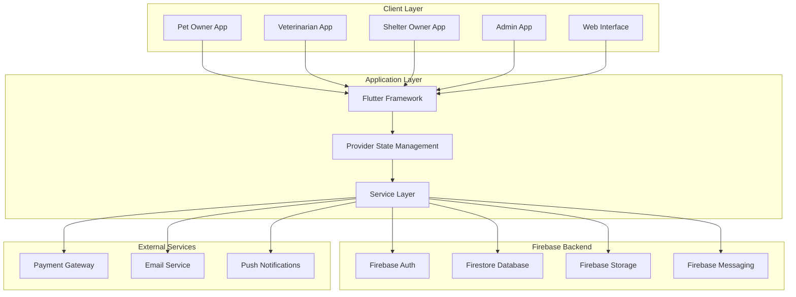
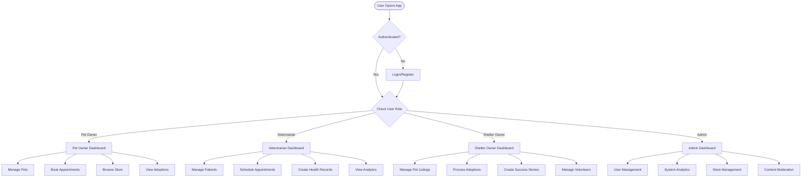
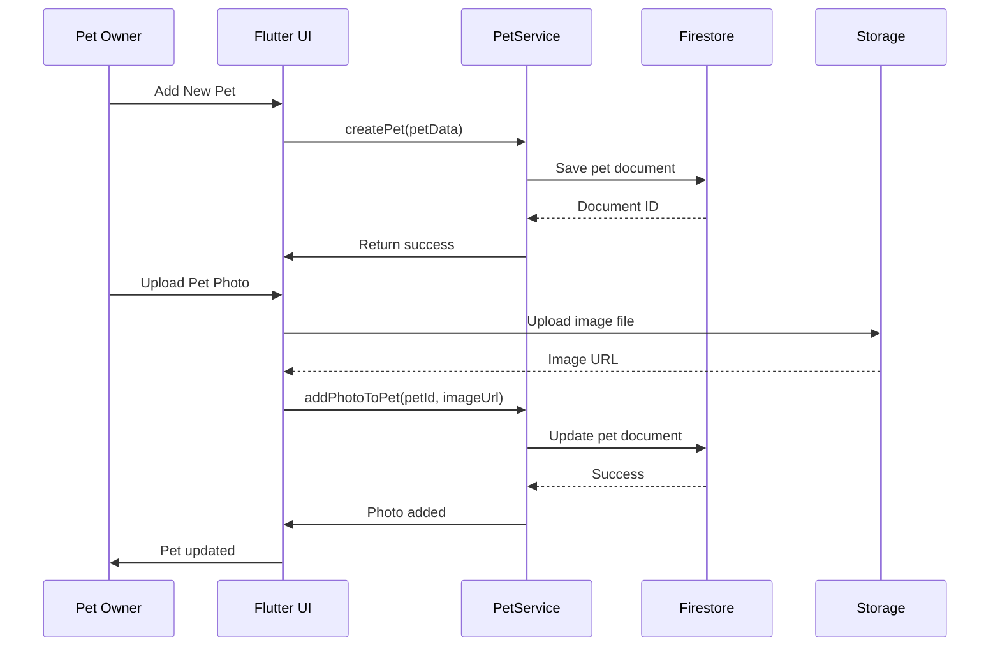
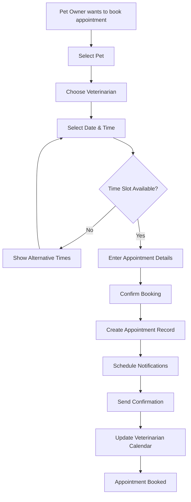
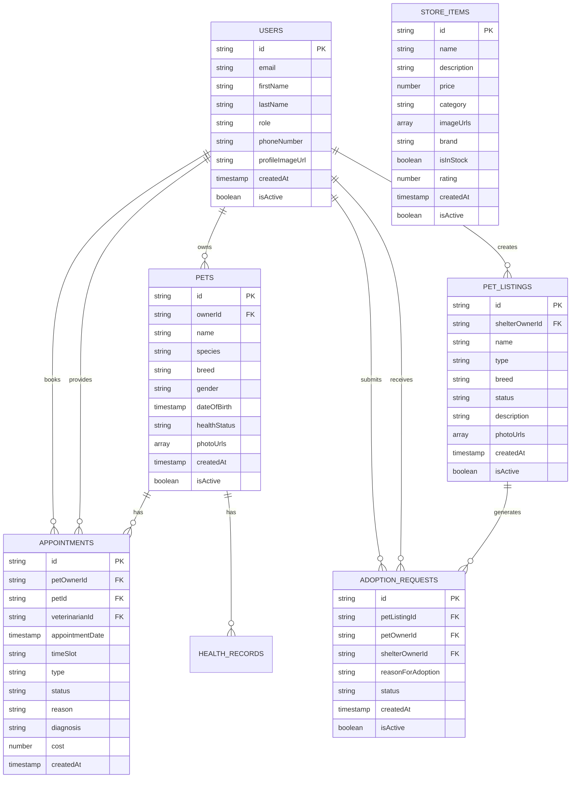
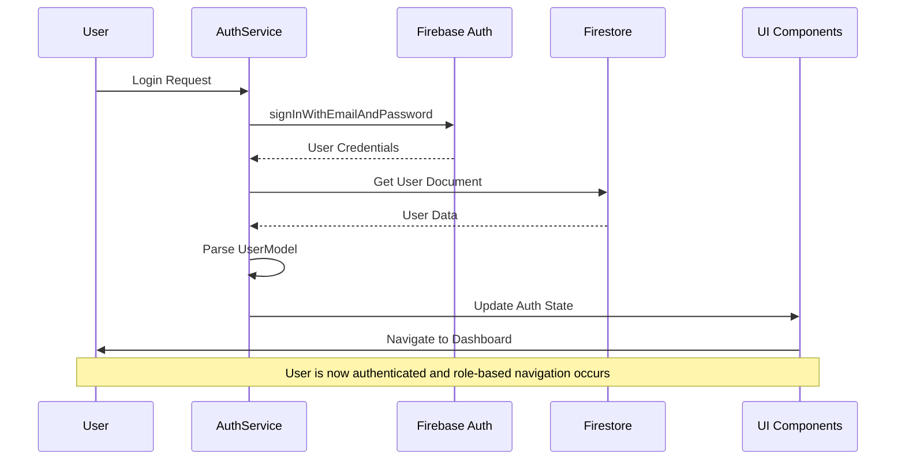
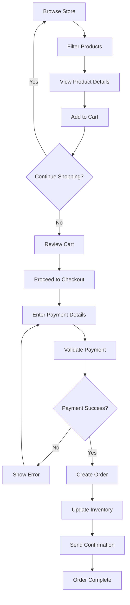
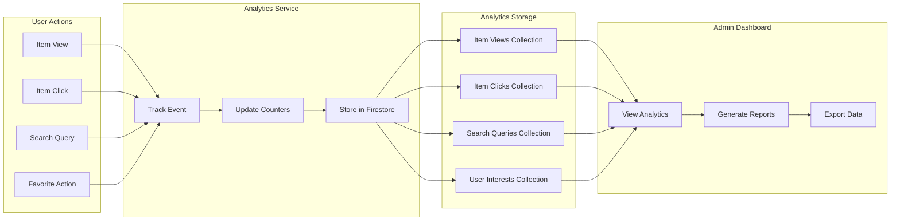
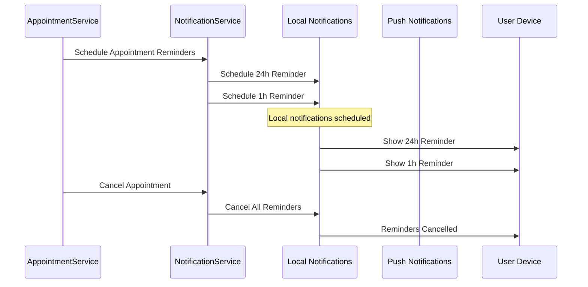
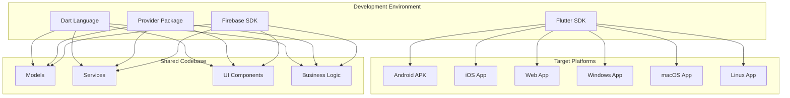

# PetCare System Diagrams

## 1. System Architecture Diagram

## 2. User Role Flow Diagram

## 3. Pet Management Data Flow

## 4. Appointment Booking Flow

## 5. Database Entity Relationship Diagram

## 6. Authentication Flow Diagram

## 7. Store Purchase Flow

## 8. Analytics Data Flow

## 9. Notification System Flow

## 10. Multi-Platform Architecture

These diagrams provide a comprehensive visual representation of the PetCare system architecture, data flows, and user interactions, complementing the detailed documentation provided earlier.
